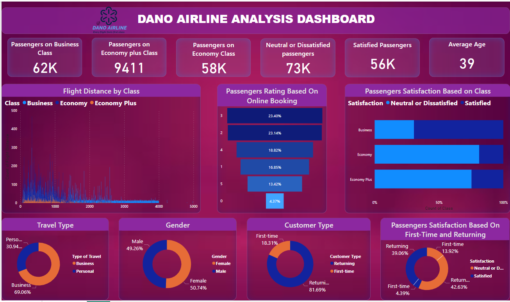
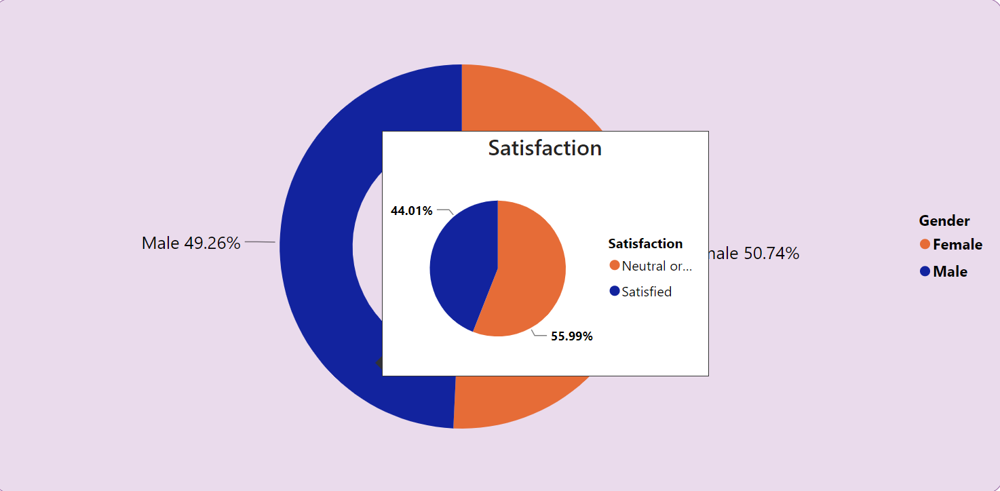
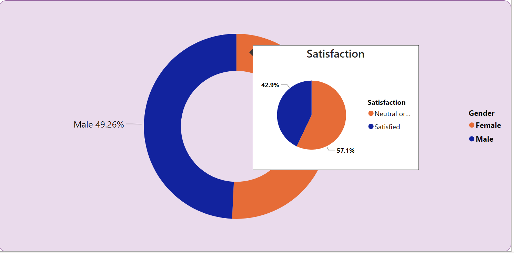
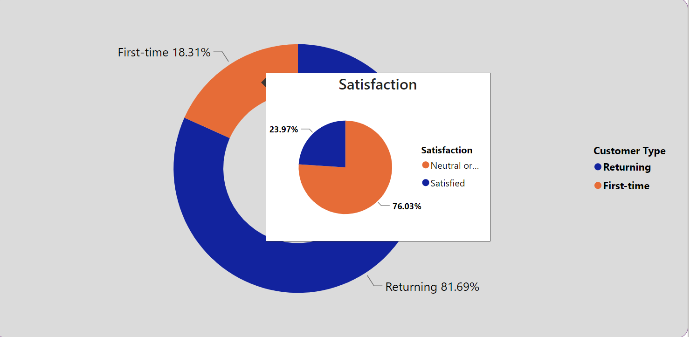
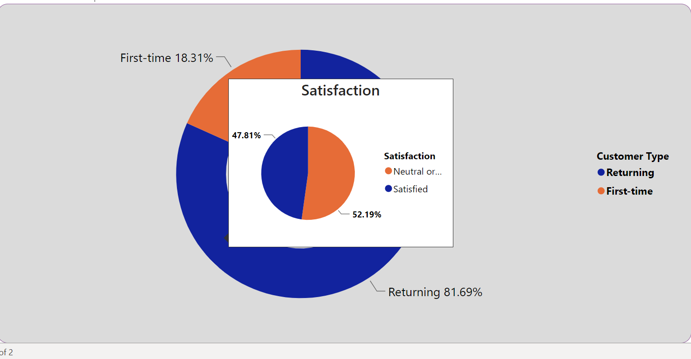
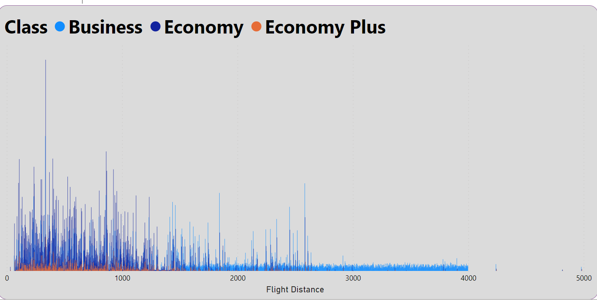
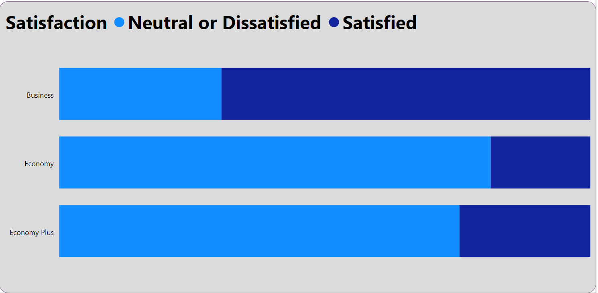
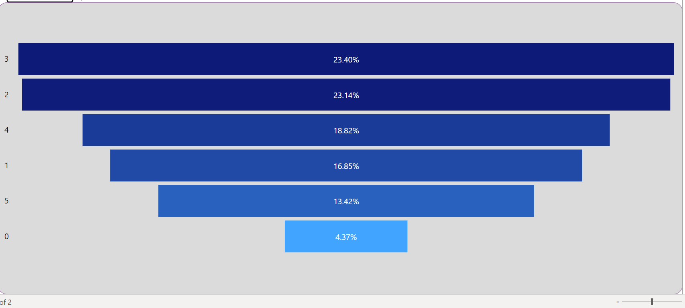
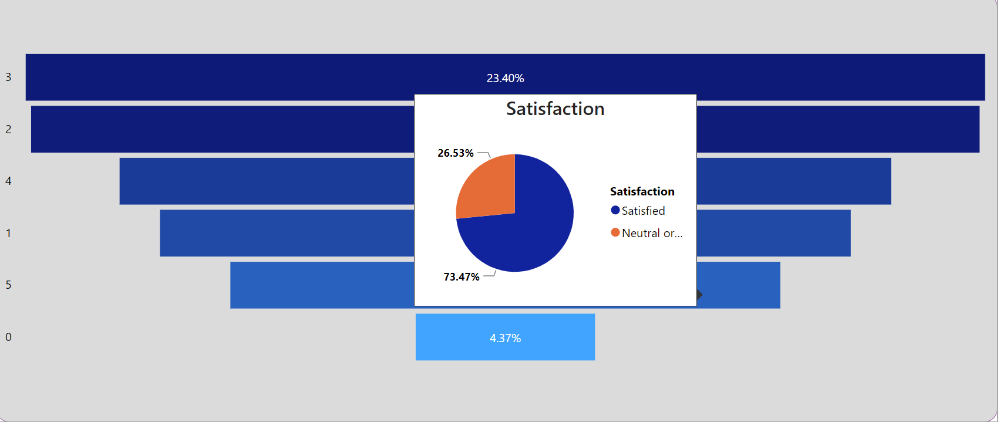

# DANA-AIRLINE-ANALYSIS

***
## INTRODUCTION: 
For this Project Analysis, I will be stepping into the role of a Data Analyst at Dano Airlines, a United Kingdom-based airline with its headquarters in London. The most recent outcomes from the passenger survey indicate a notable decline in satisfaction, falling below 50% for the first time in the airline's history. In response to this urgent situation, the leadership team is seeking prompt action, and my task is to examine the data to identify the critical areas that require attention to facilitate a swift recovery.

**_Disclaimer_**: _The dataset and reports presented here are purely hypothetical and do not represent any specific company or institution. They serve as a demonstration of Power BI capabilities using a dummy dataset._
## PROBLEM STATEMENT: 
Devise a strategy backed by data to enhance the satisfaction rate of Dano Airlines.

## POWER BI SKILLS DEMONSTRATED:
- Data cleaning
- Tooltips
- Quick Measures
- Dax
- Conditional columns

## DATA SOURCING
This dataset was provided by Digitaley Drive as my project as a scholarship student.

## DATA TRANSFORMATION 
The data underwent thorough cleaning and transformation utilizing the Power Query Editor within Power BI. Noteworthy steps applied during this process include:

- Data cleaning: involved tasks such as eliminating duplicates, rectifying data types, and addressing any instances of excess spacing.
- Creating Conditional Columns 

## DATA MODELLING: 
No data model was implemented as there is only a single table or sheet present.

## ANALYSIS AND VISUALIZATION:

In creating this visualization, I utilized multiple canvases. After conducting a comprehensive analysis, I discovered significant insights: the average age of customers is 39 years, and there are four distinct classes—business class, economy class, and economy plus.

## CONCLUSION AND RECOMMENDATION: 

  Male Satisfaction           |      Female Satisfaction
:----------------------------:|:------------------------------------:
    |   

- In this visual, there's an approximately equal distribution of men and women, and a higher percentage of both genders express dissatisfaction.

 First Timer Satisfaction          |       Returnee Satisfaction
 :--------------------------------:|:-------------------------------------:
   |    

- A significant majority of the passengers comprises of repeat customers.
- First-time travelers tend to have lower satisfaction scores.
- **Recommendation:** Implement targeted initiatives such as onboarding guides, personalized assistance, and post-travel feedback to enhance the experience for first-time passengers.
  
---

Passengers opting for longer flight distances demonstrate a preference for business class and generally report higher satisfaction levels.

The majority of passengers who chose Economy Plus or Economy Class expressed dissatisfaction with their flights, while those fortunate enough to travel in Business Class reported satisfaction.
- **Recommendation:** Invest in improving amenities for Economy, addressing issues related to legroom, cleanliness, and in-flight entertainment.

 Online Booking                | Highest Rating Satisfaction
:-----------------------------:|:-------------------------------------:
       |   

Passengers who rated online services positively showed higher overall satisfaction.
- **Recommendation:** Enhance online booking, check-in, and boarding services for a smoother passenger experience.

  

